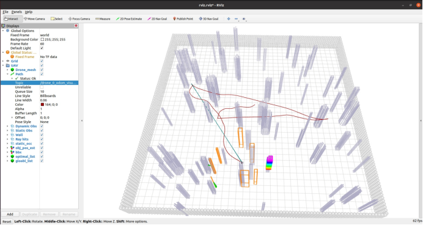

# FAPP-SocialForce: 基于社会力模型与动态膨胀的 UAV 自主避障系统

> **Note**: This repository is a **forked and improved version** of the original [FAPP](https://github.com/hku-mars/FAPP) (IEEE T-RO 2025). 
> 本项目基于 IEEE T-RO 2025 顶刊论文 **FAPP** 进行复现，并针对人机交互场景下的动态避障进行了算法改进。

---

## 🚀 核心贡献 (My Contributions)

针对原 FAPP 算法在**高动态人群密集场景**下对“意图预测不足”和“高速碰撞风险”的局限性，本项目在感知与规划层引入了以下三大改进：

### 1. 引入社会力模型 (Social Force Model Integration)
- **问题**：原算法基于卡尔曼滤波（KF）的线性预测无法处理行人为了避让无人机而产生的非线性轨迹（博弈行为）。
- **改进**：在感知模块（`mot_mapping`）中集成了 **Helbing 社会力模型**。
- **效果**：无人机现在能够“预判”行人的避让意图，计算出包含自驱动力和社会排斥力的合力，从而规划出更符合社会规则的绕行轨迹。

### 2. 基于速度的惯性阻尼 (Inertial Damping)
- **问题**：标准 SFM 在行人高速移动时会产生不切实际的大曲率“漂移”预测。
- **改进**：提出了一种基于速度的惯性阻尼机制，对侧向社会力施加衰减系数。
- **效果**：修正了高速移动下的轨迹预测，使其在保持避让趋势的同时符合物理运动学约束。

### 3. 速度感知动态膨胀 (Velocity-Aware Dynamic Inflation)
- **问题**：固定半径的障碍物膨胀无法应对高速冲撞的风险。
- **改进**：在 MINCO 轨迹优化器的代价函数中，设计了**动态膨胀策略**。将障碍物的安全半径与其**实时速度范数**及**预测不确定性**解耦。
- **效果**：面对高速障碍物时系统会自动增大安全距离，而在低速场景下保持穿越狭窄缝隙的能力。

---

## 📊 效果演示 (Demo)



---

## 🛠️ 安装与编译 (Installation)

本项目运行环境与依赖库与原 FAPP 项目保持一致。

### 1. 依赖环境
*   Ubuntu 20.04
*   ROS Noetic
*   PCL >= 1.8, Eigen >= 3.3.4

### 2. 编译
```bash
cd ${YOUR_WORKSPACE_PATH}/src
git clone https://github.com/To-sam-akf/FAPP.git
cd ..
catkin_make
```

### 3. 运行仿真
```bash
source devel/setup.bash

# 启动带有动态障碍物的仿真环境及改进后的算法
# install tmux
sudo apt install tmux
sudo apt install tmuxp
# kill a session (for example)
tmux kill-session -t fapp

tmuxp load quick_start.yaml 
```

---

## 📖 原作引用 (Original Work)

本项目基于以下优秀的开源工作进行开发，特此致谢：

**FAPP: Fast and Adaptive Perception and Planning for UAVs in Dynamic Cluttered Environments**  
*Minghao Lu, Xiyu Fan, Han Chen, and Peng Lu*  
IEEE Transactions on Robotics (**T-RO**), 2025.

如果本项目对您有帮助，请引用原作者的论文：
```bibtex
@article{lu2025fapp,
  title={FAPP: Fast and Adaptive Perception and Planning for UAVs in Dynamic Cluttered Environments},
  author={Lu, Minghao and Fan, Xiyu and Chen, Han and Lu, Peng},
  journal={IEEE Transactions on Robotics},
  volume={41},
  pages={871--886},
  year={2025},
  publisher={IEEE}
}
```

Original Repository: [hku-mars/FAPP](https://github.com/hku-mars/FAPP)

---

## 📝 License
The source code is released under **GPLv3** license.